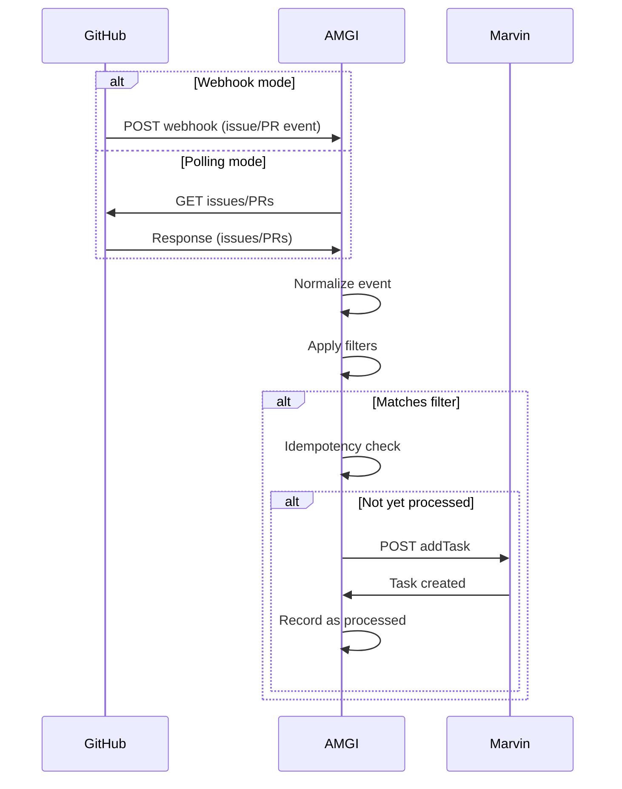
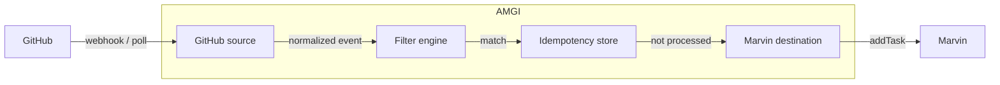

# Amazing Marvin Github Integration Architecture

This document describes in detail the Architecture AMGI syncs GitHub issues and pull requests to Amazing Marvin tasks. This Architecture document reflects the current status of 

## System overview

### Modes

AMGI supports two ways to receive GitHub events. Mode is configured per organization; both can coexist for different orgs.

#### Webhook

GitHub sends HTTP POST requests to an AMGI endpoint when issues or pull requests change; events are processed in real time. Webhooks are used when AMGI can receive inbound HTTP (public URL or tunnel).

#### Polling

AMGI periodically calls GitHub's REST API to fetch new or updated issues and PRs. Polling is used when webhooks are not feasible (firewall, no public URL, or simpler deployment).

### Data path

A GitHub event (webhook payload or API response) enters AMGI, is normalized into an internal issue/PR representation, and passes through the **filter engine**. If the event matches the configured rules, AMGI checks the **idempotency store** to see if it has already been processed. If not, it creates a Marvin task via the Marvin API and records the event as processed. If the event does not match filters or was already processed, it is discarded.

#### Processing scope

AMGI only processes items that are new or updated after it starts. It does not backfill historical issues or PRs.

- **Webhook:** GitHub sends events only when they occur. AMGI receives nothing that happened before the webhook was configured.
- **Polling:** On first run, AMGI uses `since` = now, so no items are returned. It stores a poll cursor (`last_polled_at`) in the state store. On subsequent runs, it fetches with `since` = `last_polled_at`, processes new or updated items, then updates the cursor. Idempotency ensures each issue/PR creates at most one Marvin task.

This keeps webhook and polling behavior consistent: both modes create tasks only for activity that happens after AMGI is running. See [State and idempotency](#state-and-idempotency) for how the poll cursor and idempotency keys are stored.

### Sequence diagram



## Components



### GitHub source

Receives GitHub events and normalizes them into an internal issue/PR representation. Acts as the entry point of the pipeline.

**Inputs:** Webhook HTTP POST requests (with payload) or REST API responses (list issues/PRs). 

**Outputs:** Normalized events passed to the filter engine.

**Placement:** First in the pipeline. In webhook mode, exposes an HTTP endpoint; in polling mode, periodically calls the GitHub API. Both paths produce the same internal event shape.

### Filter engine

Decides whether an event should result in a Marvin task based on configuration. Applies filter rules (labels, assignees, author, title, branches, reviewers) using operators `in`, `notIn`, `exists`, and `doesNotExist`. All conditions are ANDed; global and per-repo filters apply.

**Inputs:** Normalized event and filter configuration. 

**Outputs:** Boolean (match or no match). Only matched events proceed to the idempotency check.

**Placement:** After the GitHub source, before the idempotency store.

### Marvin destination

Creates tasks in Marvin from matched events. Renders title and note templates from event data, maps to the configured list and labels, and calls the Marvin API (addTask or equivalent).

**Inputs:** Matched event and Marvin config (list, labels, templates). 

**Outputs:** Marvin task created via API.

**Placement:** After the idempotency check, when the event is not yet processed. Handles auth, request formatting, and error handling.

### Idempotency / state store

Tracks which events have been processed so each event creates at most one Marvin task, even across restarts or duplicate deliveries.

**Inputs:** Event identifier (e.g. repo + issue/PR number). 

**Outputs:** Boolean (already processed or not); records new events as processed.

**Placement:** After the filter engine, before the Marvin destination. Persists state locally via an SQL DB. Idempotency key definition and retention/cleanup are documented in the State and idempotency section.

## Data flow

### Inbound

AMGI consumes GitHub **issues** and **pull_request** webhook events and REST API responses. The GitHub source normalizes both into the same logical event shape.

**Configurable actions (webhook only)**

In webhook mode, only events whose `action` matches the configured list create Marvin tasks. Defaults: for **issues**, `opened` and `assigned`; for **pull requests**, `review_requested` and `assigned`. Actions are configurable per organization; repositories may override.

**Polling**

Polling fetches current state (issues/PRs) from the GitHub API; it does not receive event actions. AMGI only creates tasks for issues/PRs seen for the first time (equivalent to `opened`). The actions config does not apply to polling.

Only the following actions are supported (webhook mode). Any other GitHub actions are ignored.

| Issues | Pull requests |
|--------|---------------|
| `opened` | `review_requested` |
| `assigned` | `assigned` |

**Issues**

Extracted fields (from webhook payload):

- `repository.full_name`
- `issue.number`
- `issue.title`
- `issue.body`
- `issue.state`
- `action` (opened, assigned)
- `issue.labels[].name`
- `issue.assignees[].login`
- `issue.user.login` (author)
- `issue.html_url`

**Pull requests**

Extracted fields (structure mirrors issues with `pull_request`; PR webhook adds):

- `repository.full_name`
- `pull_request.number`
- `pull_request.title`
- `pull_request.body`
- `pull_request.state`
- `action` (review_requested, assigned)
- `pull_request.labels[].name`
- `pull_request.assignees[].login`
- `pull_request.user.login` (author)
- `pull_request.base.ref` (target branch)
- `pull_request.requested_reviewers[].login`
- `pull_request.html_url`

### Internal representation

The GitHub source produces a **normalized event**—a single internal structure—from every inbound payload (webhook or API response). Webhook payloads and polling API responses have different shapes (e.g. `issue` vs `pull_request` at the root, nested vs flat). Normalization maps both into one canonical form so the filter engine and Marvin destination work on the same structure regardless of source.

**Purpose**

Filters and templates operate on this representation. Filter rules (labels, assignees, author, title, etc.) match against these fields. Marvin templates (e.g. `{{.Title}}`, `{{.Repo}}`) render from them. One normalized event flows through the pipeline from filter to idempotency to Marvin.

**Key fields**

| Field | Type | Description |
|-------|------|--------------|
| `org` | string | Organization or owner login (from `repository.full_name`). |
| `repo` | string | Repository name. |
| `number` | integer | Issue or PR number. |
| `type` | string | `issue` or `pull_request`. |
| `title` | string | Issue/PR title. |
| `body` | string | Issue/PR body (may be empty). |
| `state` | string | `open` or `closed`. |
| `action` | string | Event action; webhook only. Polling treats all as `opened`. |
| `labels` | []string | Label names. |
| `assignees` | []string | Assignee logins. |
| `author` | string | Creator login. |
| `branch` | string | Target branch (PR only). |
| `reviewers` | []string | Requested reviewer logins (PR only). |
| `html_url` | string | GitHub URL to the issue or PR. |

### Outbound

The Marvin destination sends a **POST /api/addTask** request to the Marvin API. It maps the normalized event and Marvin config into the API request body and headers.

**Purpose**

The Marvin config (selected by `marvin_config_id` resolution) defines where the task lands (list/category), which labels to attach, and how the title and note are built. Templates render from the normalized event; the result is sent to Marvin. Auth uses the `X-API-Token` header. The `X-Auto-Complete` header controls whether Marvin parses operators in the title (e.g. `+today`, `#Category`); when false, the title is literal.

**Request mapping**

Config fields map to the addTask API as follows:

| Config | API field / header | Description |
|--------|--------------------|-------------|
| `title_template` (rendered) | `title` | Task title. Variables from normalized event (e.g. `{{.Title}}`, `{{.Repo}}`, `{{.Number}}`). |
| `note_template` (rendered) | `note` | Task body. |
| `list_id` | `parentId` | Category or project ID; `"unassigned"` for Inbox. |
| `list_name` | `parentId` | Resolved via GET /api/categories; ignored if `list_id` is set. |
| `label_ids` | `labelIds` | Label IDs to attach. |
| `label_names` | `labelIds` | Resolved via GET /api/labels. |
| `auto_complete` | `X-Auto-Complete` | `true` (default): Marvin parses title operators; `false`: literal title. See [Autocomplete](#autocomplete). |
| `task.*` | addTask body | Optional task fields (day, due_date, time_estimate_ms, priority, frog, etc.). See schema for config fields and Marvin API for addTask field semantics. |

See [Configuration](#configuration) for template syntax and [Integrations](#integrations) for API details.

### Idempotency

The idempotency key uniquely identifies an issue or PR, not the action. We use `{org}/{repo}#{number}` (e.g. `acme/foo#42`). This ensures that when multiple actions fire for the same item (e.g. `opened` then `assigned`), only one Marvin task is created. The key is computed after the filter matches. It is checked against the store before creating a Marvin task. If the key exists, the event is skipped. If not, the task is created and the key is recorded. Store schema and retention are documented in [State and idempotency](#state-and-idempotency).

## Configuration

### Config file structure

The config file is YAML. Top-level keys: `version` (required), `filters` (optional), `webhook_server` (optional; required when any org uses webhook), `github` (required), `marvin` (required). The full schema is defined in [docs/schema.yaml](schema.yaml). Config validation: [[[PLACEHOLDER]]] update when the config linter is defined.

### Webhook server

When any organization uses `mode: webhook`, AMGI runs an HTTP server to receive webhooks. Configure top-level `webhook_server`. Omit `port` or `path` to use defaults:

| Key | Default | Description |
|-----|---------|-------------|
| `port` | `8080` | Port AMGI listens on. |
| `path` | `/webhooks/github` | Path for the webhook endpoint. Must match the path in GitHub's Payload URL. Must start with `/`. |

### Filter operators

Filters use four operators (Kubernetes-inspired): `in`, `notIn`, `exists`, `doesNotExist`. All conditions are ANDed within and across fields. Global filters apply to all repos unless a repo defines its own `filters`; per-repo filters replace global for that repo.

| Operator | Semantics | Value type |
|----------|-----------|------------|
| `in` | Field value must be in the list | array of strings |
| `notIn` | Field value must not be in the list | array of strings |
| `exists` | At least one value must exist (`true`) or no values (`false`) | boolean |
| `doesNotExist` | No values (`true`) or at least one value (`false`) | boolean |

**Examples**

```yaml
filters:
  issues:
    labels:
      in: [bug, enhancement]
    assignees:
      exists: true
  pull_requests:
    branches:
      in: [main, develop]
    reviewers:
      exists: true
```

### Marvin config ID resolution

A Marvin config defines where a task goes (list/category), which labels it gets, and how its title and note are formatted. For each event we must pick one config. The `marvin_config_id` selects which config to use; it can be set per organization or per repository.

**Lookup**

For an event in org `acme` and repo `foo`: if `foo` is defined as an object with `marvin_config_id`, use that. Otherwise use the organization's `marvin_config_id`. Every organization must have `marvin_config_id`; repositories may override it.

**Example**

```yaml
github:
  organizations:
    - name: acme
      mode: webhook
      marvin_config_id: issues-config      # default for all repos in this org
      repositories:
        - bar                              # uses issues-config (org default)
        - name: foo
          marvin_config_id: pr-config      # overrides; uses pr-config for foo only
marvin:
  configs:
    - id: issues-config
      task:
        title_template: "Issue No. {{.Number}}: {{.Title}}"
        note_template: "{{.Body}}"
    - id: pr-config
      task:
        title_template: "Review PR No. {{.Number}} in {{.Repo}}"
        note_template: "{{.Body}}"
```

Events in `acme/bar` use `issues-config`. Events in `acme/foo` use `pr-config`.

### Template syntax

Templates use [Go template](https://pkg.go.dev/text/template) syntax. Variables are derived from the [normalized event](#internal-representation). Available fields:

- `Org`
- `Repo`
- `Number`
- `Type`
- `Title`
- `Body`
- `State`
- `Action`
- `Labels` (comma-separated)
- `Assignees` (comma-separated)
- `Author`
- `Branch` (PR only)
- `Reviewers` (comma-separated, PR only)
- `HtmlUrl`

> ⚠️ **Warning:** When `auto_complete` is enabled, Marvin interprets certain characters in the title as input bar shortcuts (e.g. `#` for category, `@` for label, `+` for schedule). For the full list of keybindings, see [Keyboard shortcuts in Marvin](https://help.amazingmarvin.com/en/articles/4848263-keyboard-shortcuts-in-marvin#h_43115cf851). For how auto_complete affects title parsing, see [Autocomplete](#autocomplete).

#### Title examples

```yaml
# Simple: "Issue No. 42: Fix login bug"
title_template: "{{.Type}} No. {{.Number}}: {{.Title}}"

# With repo context: "Review PR No. 42 in acme/foo"
title_template: "Review {{.Type}} No. {{.Number}} in {{.Org}}/{{.Repo}}"

# With action: "Assigned: Issue No. 42"
title_template: "{{.Action}}: {{.Type}} No. {{.Number}}"
```

#### Note examples

```yaml
# Minimal: issue body only
note_template: "{{.Body}}"

# With metadata
note_template: |
  **Author:** {{.Author}}
  **Repo:** {{.Org}}/{{.Repo}}
  **Link:** {{.HtmlUrl}}
  ---
  {{.Body}}

# With assignees
note_template: |
  **Author:** {{.Author}}
  **Assignees:** {{.Assignees}}
  {{.Body}}

# PR with reviewers
note_template: |
  **Author:** {{.Author}}
  **Branch:** {{.Branch}}
  **Reviewers:** {{.Reviewers}}
  {{.Body}}
```

### Actions (webhook only)

> ℹ️ **Info:** Actions config is ignored when `mode` is `polling`.

**Supported actions**

- Issues: `opened`, `assigned`
- Pull requests: `review_requested`, `assigned`

Any other GitHub actions are ignored.

**Defaults**

- Issues: `[opened, assigned]`
- Pull requests: `[review_requested, assigned]`

Configurable per organization; repositories may override.

**Lookup**

For an event in org `acme` and repo `foo`: if `foo` is defined as an object with `actions`, use that. Otherwise use the organization's `actions`. When omitted at both levels, defaults apply.

**Example**

```yaml
github:
  organizations:
    - name: acme
      mode: webhook
      actions:
        issues: [opened, assigned]
        pull_requests: [review_requested, assigned]
      repositories:
        - bar                    # uses org actions
        - name: foo
          actions:               # override for foo only
            issues: [opened]      # no assigned for this repo
```

### Example

```yaml
version: "1"
filters:
  issues:
    labels:
      in: [bug, enhancement]
    assignees:
      exists: true
  pull_requests:
    branches:
      in: [main, develop]
    reviewers:
      exists: true
webhook_server:
  port: 8080
  path: /webhooks/github
github:
  organizations:
    - name: acme
      mode: webhook
      marvin_config_id: issues-config
      actions:
        issues: [opened, assigned]
        pull_requests: [review_requested, assigned]
      repositories:
        - bar
        - name: foo
          marvin_config_id: pr-config
          actions:
            issues: [opened]
          filters:
            issues:
              labels:
                in: [bug]
            pull_requests:
              branches:
                in: [main]
marvin:
  configs:
    - id: issues-config
      list_name: Inbox
      label_names: [github]
      task:
        title_template: "{{.Type}} No. {{.Number}}: {{.Title}}"
        note_template: |
          **Author:** {{.Author}}
          **Assignees:** {{.Assignees}}
          **Link:** {{.HtmlUrl}}
          ---
          {{.Body}}
    - id: pr-config
      list_name: Reviews
      label_names: [github, pr]
      task:
        title_template: "Review {{.Type}} No. {{.Number}} in {{.Org}}/{{.Repo}}"
        note_template: |
          **Author:** {{.Author}}
          **Branch:** {{.Branch}}
          **Reviewers:** {{.Reviewers}}
          **Link:** {{.HtmlUrl}}
          ---
          {{.Body}}
```

## Integrations

This section describes the integration contracts: what AMGI uses from GitHub and Marvin, how it calls them, and how it handles errors and limits.

### GitHub

#### Webhooks

AMGI receives GitHub webhook events via HTTP POST. Only `issues` and `pull_request` event types are consumed.

**Payload fields**

Extracted fields are documented in [Data flow > Inbound](#inbound). The GitHub source normalizes webhook payloads into the internal representation.

**Signature validation**

GitHub signs each webhook payload with a hash (HMAC-SHA256) and sends it in the `X-Hub-Signature-256` header. This proves the request came from GitHub and the body was not altered in transit. It is distinct from SSL verification (which secures the connection); signature validation verifies the payload itself.

When you add a webhook in GitHub, the **Secret** field is where you set a shared secret. GitHub uses it to compute the signature; AMGI must have the same secret (via env, e.g. `GITHUB_WEBHOOK_SECRET`) to recompute and compare. If the values match, the webhook is accepted. If they differ or the secret is missing, AMGI rejects the request with 401.

**Endpoint**

AMGI exposes an HTTP endpoint for webhook delivery.

- **Path and port:** Configurable with defaults (see [Configuration](#configuration)); port defaults to `8080`, path to `/webhooks/github`. The user enters the same path and port in GitHub's Payload URL (e.g. `https://their-host:8080/webhooks/github`, or `https://their-host/webhooks/github` when behind a reverse proxy on 443).
- **Method:** POST
- **Responses:** 200 on success; 401 on invalid signature; 500 on internal error (GitHub may retry)

#### Polling

When `mode` is `polling`, AMGI fetches issues and pull requests from the GitHub REST API.

**Endpoints**

- Issues: `GET /repos/{owner}/{repo}/issues`
- Pull requests: `GET /repos/{owner}/{repo}/pulls`

**Query parameters**

AMGI sends these parameters with each request:

- `state=open` — Only open issues/PRs (excludes closed).
- `sort=updated` — Order by last update time.
- `direction=desc` — Newest first.
- `per_page` (e.g. 100) — Items per page (GitHub allows up to 100).
- `since` (ISO 8601) — Only items updated after this timestamp. AMGI uses this for incremental sync to detect first-time-seen items (equivalent to `opened` in webhook mode).

AMGI supports pagination and fetches all pages until complete. After each poll, it updates `last_polled_at` in the state store for the next run.

**Auth**

`GITHUB_TOKEN` (Personal Access Token). Required permissions:

- **Classic PAT:** `repo` (private repos) or `public_repo` (public repos only).
- **Fine-grained PAT:** Repository permissions — Issues (Read-only), Pull requests (Read-only), Metadata (Read-only).

#### Rate limits

GitHub enforces rate limits (e.g. 5,000 requests/hour for authenticated requests). AMGI respects `X-RateLimit-*` headers. On 403 (rate limit exceeded), AMGI backs off and retries after the reset time. See [Error handling strategy](#error-handling-strategy) and [Rate limit compliance](#rate-limit-compliance).

#### Auth

| Purpose | Credential | Source |
|---------|------------|--------|
| Webhook signature verification | Webhook secret | Env: `GITHUB_WEBHOOK_SECRET` |
| Polling API calls | PAT with `repo` or `public_repo` (classic), or Issues + Pull requests read (fine-grained) | Env: `GITHUB_TOKEN` |

### Marvin

#### Endpoints

Base URL: `https://serv.amazingmarvin.com`. Source: [Marvin API wiki](https://github.com/amazingmarvin/MarvinAPI/wiki).

| Purpose | Endpoint | Method |
|---------|----------|--------|
| Create task | `/api/addTask` | POST |
| Resolve list by name | `/api/categories` | GET |
| Resolve labels by name | `/api/labels` | GET |
| Test credentials | `/api/test` | POST |

When config uses `list_name` or `label_names`, AMGI calls `GET /api/categories` and `GET /api/labels` to resolve names to IDs before creating tasks.

#### Request shape

**Headers**

- `X-API-Token` (required) — Marvin API token from [app.amazingmarvin.com/pre?api](https://app.amazingmarvin.com/pre?api)
- `Content-Type: application/json` — POST bodies are JSON
- `X-Auto-Complete` — `true` (default) or `false`; see [Autocomplete](#autocomplete)

**Body**

The addTask request body maps from the Marvin config and rendered templates. See [Data flow > Outbound](#outbound) for the mapping table. Config fields and their Marvin API equivalents (all in [schema](schema.yaml)):

- `title_template` → `title`
- `note_template` → `note`
- `list_id` / `list_name` → `parentId`
- `label_ids` / `label_names` → `labelIds`
- `task.day` → `day`
- `task.due_date` → `dueDate`
- `task.start_date` → appended to title as operator when `auto_complete` is true (not a body field)
- `task.end_date` → appended to title as operator when `auto_complete` is true (not a body field)
- `task.planned_week` → `plannedWeek`
- `task.planned_month` → `plannedMonth`
- `task.time_estimate_ms` → `timeEstimate` (ms)
- `task.priority` → `isStarred` (0–3)
- `task.frog` → `isFrogged` (0–3)
- `task.review_date` → `reviewDate`
- `task.section` → `dailySection` or `customSection`
- `task.is_reward` → `isReward`
- `task.reward_points` → `rewardPoints`

Only fields present in the config are sent.

#### Templates

Template variables and rendering are documented in [Configuration > Template syntax](#template-syntax). List fields (`Labels`, `Assignees`, `Reviewers`) are comma-separated strings.

#### Autocomplete

When `X-Auto-Complete` is true (default), Marvin parses the title for operators (e.g. `+today`, `#Category`, `@label`) and resolves them to IDs. Use `X-Auto-Complete=false` to send the title literally. See [Keyboard shortcuts in Marvin](https://help.amazingmarvin.com/en/articles/4848263-keyboard-shortcuts-in-marvin#h_43115cf851) for the full list of keybindings; use false when you want to avoid Marvin interpreting characters in your template output.

#### Rate limits and error handling

**Marvin API rate limits** (from [MarvinAPI marvin-api.yaml](https://github.com/amazingmarvin/MarvinAPI/blob/main/marvin-api.yaml)):

- max 1 item per second
- max 1 query per 3 seconds burst
- max 1440 queries per day

See [Rate limit compliance](#rate-limit-compliance) for how AMGI respects these when processing many issues.

**Error responses**

| Status      | Behavior                                      |
|-------------|-----------------------------------------------|
| 429 or 5xx  | Retry with exponential backoff (max 3 attempts) |
| 401 or 400  | No retry; errors are logged                   |

See [Error handling strategy](#error-handling-strategy).

### Error handling strategy

#### Retries and backoff

| Condition | Behavior |
|-----------|----------|
| 5xx (GitHub or Marvin) | Retry with exponential backoff; max 3 attempts |
| 429 (rate limit) | Respect `Retry-After` if present; otherwise backoff; max 3 attempts |
| 401, 400, 404 | No retry; log and fail |

#### Rate limit compliance

When processing many issues (e.g. initial sync or backlog), AMGI avoids exceeding limits by:

- **GitHub:** List issues/PRs returns up to 100 items per page. AMGI uses pagination; few requests fetch many items. 5,000 requests/hour is sufficient for polling. On 403 (rate limit exceeded), AMGI backs off per `X-RateLimit-Reset` and retries.
- **Marvin addTask:** Max 1 item per second. AMGI processes matched events sequentially and waits ≥1 second between each addTask call. A backlog of 100 issues thus takes at least ~100 seconds.
- **Marvin reads (categories, labels):** Max 1 query per 3 seconds burst. AMGI caches resolved list and label IDs; resolution happens at startup or when config changes, not per task. If multiple GETs are needed, they are spaced by ≥3 seconds.

#### Failure behavior

**At-least-once**

Webhook delivery may be retried by GitHub. AMGI uses idempotency keys to ensure each issue/PR creates at most one Marvin task. Duplicate webhook deliveries are handled by the idempotency store.

**Partial failure**

If Marvin addTask fails after filter match, AMGI retries (up to 3 attempts). If all retries fail, the event is stored for retry rather than discarded. The poll cursor always advances; we do not re-fetch the same batch on failure.

**Retry flow**

- Each run: process pending retries first (events that failed addTask on a previous run), then run the normal poll.
- On addTask success: mark the event as processed.
- On addTask failure (after 3 attempts): store the event with status `pending_retry` so it is retried on the next run. Store enough data (e.g. serialized event) to retry without re-fetching from GitHub.

## State and idempotency

*(Where we persist, what we store, how we prevent duplicates.)*

- [ ] Store: SQLite (path, single-writer assumption if any)
- [ ] Schema: main tables and key columns

**github_artifacts**

| Column | Type | Purpose |
|--------|------|---------|
| `id` | INTEGER PRIMARY KEY AUTOINCREMENT | Synthetic key; queries mostly use `(org, repo, number)` |
| `org` | TEXT NOT NULL | Organization or owner |
| `repo` | TEXT NOT NULL | Repository name |
| `number` | INTEGER NOT NULL | Issue or PR number |
| `type` | TEXT NOT NULL | `issue` or `pull_request` |
| `title` | TEXT | Issue/PR title (for display) |
| `status` | TEXT NOT NULL | `processed` or `pending_retry` |
| `detected_on` | TIMESTAMP NOT NULL | When first seen |
| `updated_at` | TIMESTAMP NOT NULL | When status last changed |
| `retry_count` | INTEGER DEFAULT 0 | Number of addTask retries (for `pending_retry` rows) |
| `event_data` | JSON | Serialized event for retry; null when `processed` |

`UNIQUE (org, repo, number)` for idempotency. See [Failure behavior](#failure-behavior) for retry flow.

**poll_state**

| Column | Type | Purpose |
|--------|------|---------|
| `id` | INTEGER PRIMARY KEY AUTOINCREMENT | Synthetic key; queries use `(org, repo)` |
| `org` | TEXT NOT NULL | Organization |
| `repo` | TEXT NOT NULL | Repository |
| `last_polled_at` | TIMESTAMP NOT NULL | Used as `since` on next poll |

`UNIQUE (org, repo)`.

**Store**

SQLite database. Path configurable (TBD). Single-writer assumption: one AMGI process per database.

**Duplicate detection**

Idempotency key: `{org}/{repo}#{number}` (see [Idempotency](#idempotency)). Lookup uses `(org, repo, number)` against `github_artifacts`. Lifecycle: row created on first seen; status updated to `processed` on addTask success or `pending_retry` on failure; no automatic deletion.

**Retention**

No automatic retention. Processed rows are kept indefinitely. See [Roadmap](Roadmap.md) for future retention options.

## Operational considerations

### Deployment model

Single binary, single container image. One process runs the webhook server and/or poller. Config file (YAML), SQLite database (path configurable), and secrets via env vars.

### Secrets

| Secret | Required when | Purpose |
|--------|----------------|---------|
| `GITHUB_TOKEN` | Polling mode | PAT for GitHub API |
| `GITHUB_WEBHOOK_SECRET` | Webhook mode | Verify webhook signatures |
| `MARVIN_API_TOKEN` | Always | Create Marvin tasks |

Supplied via env vars. AMGI reads from the process environment; operators can use plain env vars, Kubernetes Secrets (mounted as env), or secret managers that inject env vars. 

## Future considerations / out of scope

See [docs/Roadmap.md](Roadmap.md) for goals, non-goals, and future considerations (e.g. multi-tenancy).
